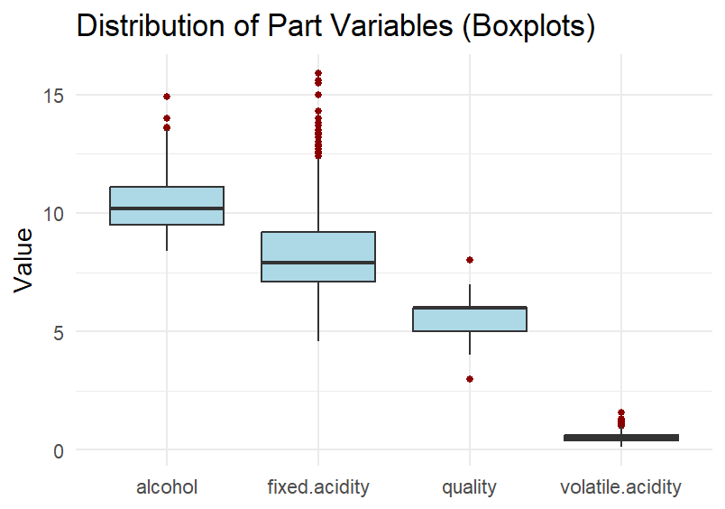
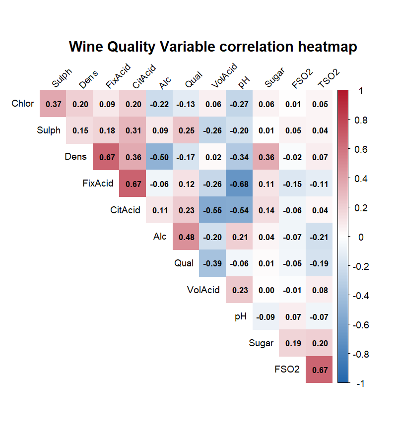
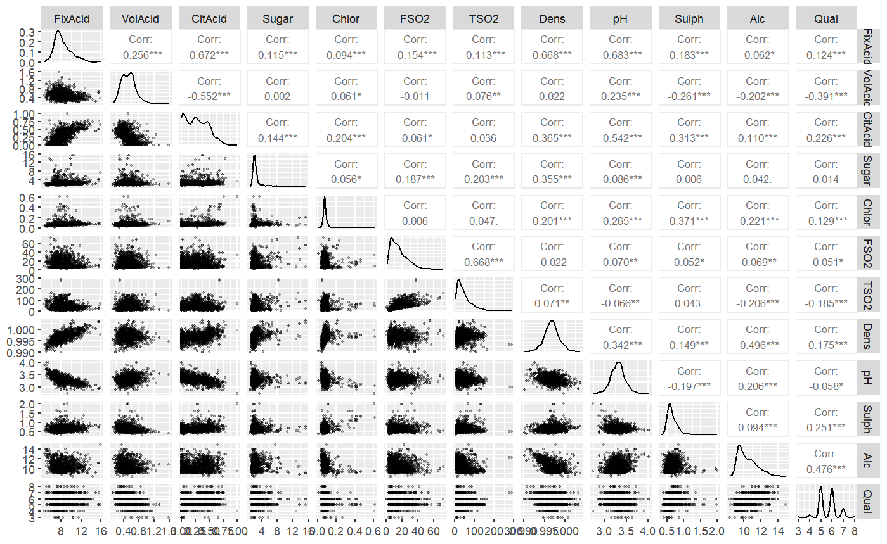
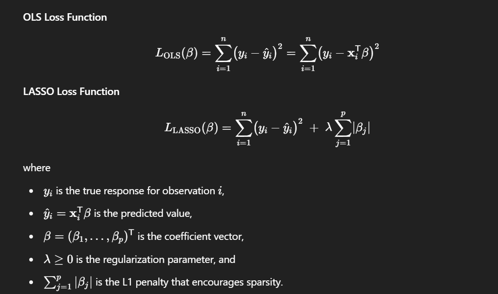
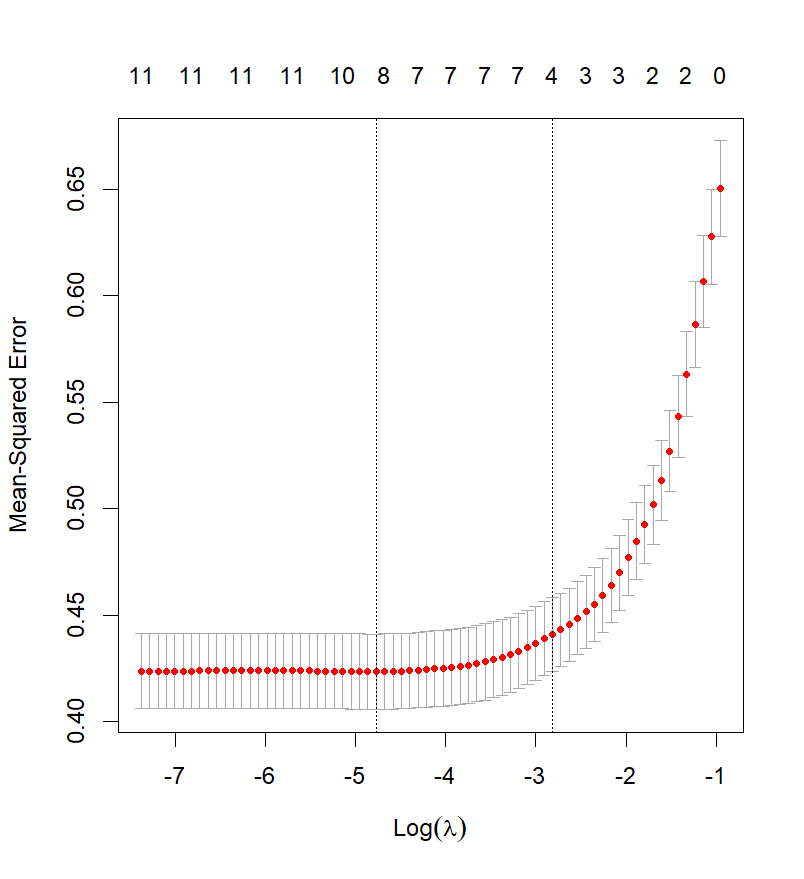
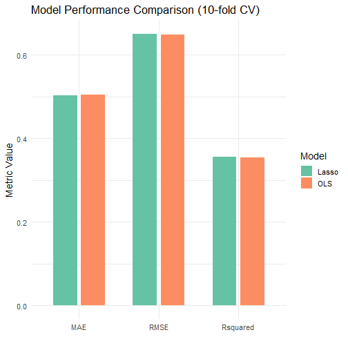
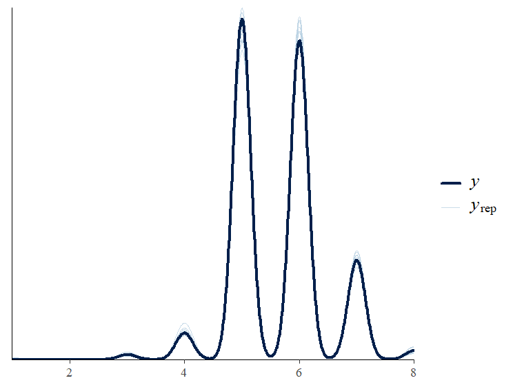

#Background & Data Overview
#### **Objective:** Understand which wine chemistry variables drive quality scores
#### **Data Source:** UCI Red Wine Quality

- Key Variables (n = 1599, p = 12)

- **You can find data here:** [link](https://archive.ics.uci.edu/ml/machine-learning-databases/wine-quality/winequality-red.csv)

- *Response:* quality (3–8 scale)

- *Predictors:* physicochemical measures (acidity, sulphur, alcohol, etc.)

```{r my-analysis, echo=FALSE, message=FALSE, warning=FALSE}
# Loading necessary library
library(tidyverse)
library(here)
library(dplyr)
library(tidyr)
library(ds4ling)
library(lme4)
library(lmerTest)
library(GGally)       # ggpairs()
library(corrplot)     # corrplot()
library(ggcorrplot)   # ggcorrplot()
library(glmnet)
library(caret)
library(rstanarm)
library(knitr)

# Read the raw data
data_wine_raw <- read.csv(
  here("data_raw", "winequality-red.csv"),
  header = TRUE,
  sep = ";",
  stringsAsFactors = FALSE
)

data_wine_tidy <- data_wine_raw |>
  rename(
    FixAcid = fixed.acidity,
    VolAcid = volatile.acidity,
    CitAcid = citric.acid,
    Sugar   = residual.sugar,
    Chlor   = chlorides,
    FSO2    = free.sulfur.dioxide,
    TSO2    = total.sulfur.dioxide,
    Dens    = density,
    pH      = pH,
    Sulph   = sulphates,
    Alc     = alcohol,
    Qual    = quality
  )

mini_table <- data_wine_tidy |>
  select(FixAcid, VolAcid, Sugar, Chlor, Alc, Qual) |>
  head(6)
kable(mini_table, caption = "data_wine_tidy (Part vars)", align="c")
```


---
#Descriptive Statistics

####Five-Number Summaries (min, Q1, median, Q3, max)

####Variables fixed.acidity, volatile.acidity, alcohol, quality, ...

```{r, echo=FALSE, message=FALSE, warning=FALSE}
five_num_summary <- data_wine_tidy %>%
  summarise(across(
    .cols = everything(),
    .fns = list(
      Min  = ~ min(.x, na.rm = TRUE),
      Q1   = ~ quantile(.x, 0.25, na.rm = TRUE),
      Median = ~ median(.x, na.rm = TRUE),
      Q3   = ~ quantile(.x, 0.75, na.rm = TRUE),
      Max  = ~ max(.x, na.rm = TRUE)
    ),
    .names = "{.col}_{.fn}"
  )) %>%
  pivot_longer(everything(),
               names_to = c("variable", "stat"),
               names_sep = "_",
               values_to = "value") %>%
  pivot_wider(names_from = stat, values_from = value)


# print with knitr::kable
kable(five_num_summary, 
      caption = "Five‐Number Summaries for All Variables",
      digits = 2, 
      align = "c")
```


---
#Descriptive Statistics
#### Graphic:


```{r fig-box, echo=FALSE, out.width = '80%', fig.align='center'}

```

---
#Correlation Heatmap
####Reveals linear relationships among all 12 variables

####Strongest with quality:

- +0.48 alcohol ↔ quality

- –0.39 volatile.acidity ↔ quality

```{r heat, echo=FALSE, out.width = '45%', fig.align='center'}

```

---
#Pairwise Scatterplot Matrix
####Visual check of:

- Bivariate trends (points)

- Marginal densities (diagonals)

- Pearson r in upper panels

```{r pairwise, echo=FALSE, out.width = '60%', fig.align='center'}

```

---
#OLS Regression
####**Model: lm(quality ~ .)**

- Fit: R² = 0.36, Adj-R² = 0.356, F(11,1587) p < 2e-16

- Significant predictors (p<0.05):

- volatile.acidity (–1.08)

- chlorides (–1.87)

- total.sulfur.dioxide (–0.0033)

- free.sulfur.dioxide (+0.0044)

- pH (–0.41)

- sulphates (+0.92)

- alcohol (+0.276)
---
#OLS Regression
#### OLS model summary
```{r OLS-model, echo=FALSE, message=FALSE, warning=FALSE}
model_ols <- lm(Qual ~ ., data = data_wine_tidy)
knitr::kable(summary(model_ols)$coefficients)
```

---

#OLS Diagnostic Checks
#### Residual Diagnostics for OLS Model
```{r OLs_res, echo=FALSE, out.width = '55%', fig.align='center'}
knitr::include_graphics("plots/OLS_res.png")
```
---
### Evaluation of Residuals
- **Linearity & Homoscedasticity**:  
  Residuals vs Fitted plot shows a random scatter with no clear pattern, supporting the linearity assumption. However, slight heteroscedasticity may be present as variance appears to increase with fitted values.

- **Normality**:  
  Q-Q plot shows residuals largely follow the diagonal (r = 0.95), indicating approximate normality. Minor deviations at the tails suggest slight non-normality.

- **Residual Distribution**:  
  Residual density plot is centered around zero with a single peak, consistent with a well-fitted model, though slight skewness is observed.

### Conclusion
- The OLS model (`Qual ~ .`) appears reasonably well-specified, with assumptions of linearity and normality largely met. However, minor heteroscedasticity and non-normality at the tails warrant further investigation or potential model refinement.
---

## Introduction to LASSO Model

#### What is LASSO?
- **LASSO** (Least Absolute Shrinkage and Selection Operator) is a regression method that performs both variable selection and regularization.
- Extends OLS by adding an L1 penalty to the loss function.

#### Mathematical Formulation
```{r Formula, echo=FALSE, out.width = '25%', fig.align='center'}

```

#### Advantages of LASSO
- **Variable Selection**: Automatically sets less important coefficients to zero.  
- **Prevents Overfitting**: Regularization reduces model complexity.  
- **Handles Multicollinearity**: Effective when predictors are correlated.

---
#Lasso Regression & Variable Selection
###Method: glmnet with 10-fold CV, α=1

####Optimal λ: ~0.0085

####Variables retained (non-zero):
- volatile.acidity, chlorides, residual.sugar, free.sulfur.dioxide, total.sulfur.dioxide, pH, sulphates, alcohol
```{r cv_lasso, echo=FALSE, out.width = '40%', fig.align='center'}

```

---
#Lasso Regression & Variable Selection

#### Evaluation of MSE vs Log(λ)
- **MSE Trend**:  
  The Mean Squared Error (MSE) increases as Log(λ) increases from -7 to -1. In order to prevent over fitting we think Log(λ) = -3 is the best.

- **Model Complexity**:  
  The numbers on top (11 to 0) indicate the number of non-zero coefficients. As λ increases, fewer predictors are selected, reducing model complexity.

- **Optimal λ**:  
  The vertical dashed lines mark the optimal λ (Log(λ) ≈ -3) and the 1-SE rule (Log(λ) ≈ -2). The model with Log(λ) = -3 balances fit and simplicity.

#### **Conclusion**
- LASSO effectively reduces model complexity by shrinking coefficients, with the optimal λ achieving the lower MSE (0.40) while retaining 3 predictors. This suggests a parsimonious model with good predictive performance.

---
#Model Performance Comparison
- LASSO and OLS perform similarly in predicting wine quality, with minimal differences in MAE, RMSE, and R².
```{r model_cp, echo=FALSE, out.width = '70%', fig.align='center'}

```

---
#Bayesian Regression
## Bayesian Regression: Model Evaluation

### Key Findings
- **Posterior Medians (MAD_SD)**:  
  - volatile.acidity: -1.11 (0.12)  
  - chlorides: -1.62 (0.39)  
  - sulphates: +0.86 (0.11)  
  - alcohol: +0.30 (0.02)  
  - These predictors show strong effects on wine quality with tight uncertainty.
- **95% Credible Intervals**:  
  - Excludes zero for: volatile.acidity (-1.337, -0.872), chlorides (-2.358, -0.839), pH (-0.767, -0.174), sulphates (0.636, 1.065), alcohol (0.263, 0.330).  
  - Indicates high confidence in these predictors' impact.
---
```{r , echo=FALSE, message=FALSE, warning=FALSE}
priors <- c(
  set_prior("normal(0, 1)", class = "b"),         # fixed effects 的先验
  set_prior("normal(0, 5)", class = "Intercept")  # 截距的先验
)

model_bayes <- brm(
  Qual ~ .,
  data            = data_wine_tidy,
  family          = cumulative(link = "logit"),
  prior           = priors,
  chains          = 4,
  cores           = parallel::detectCores(),
  iter            = 2000,
  seed            = 2025
)

# Extract 95% credible intervals
ci <- posterior_interval(model_bayes, prob = 0.95)

# Round and display as a table
ci_rounded <- round(ci, 3)
kable(ci_rounded,
      caption = "95% Credible Intervals for Model Coefficients",
      col.names = c("Lower (2.5%)", "Upper (97.5%)"),
      align = "c")
```


- **Non-Significant Predictors**:  
  - FixAcid, CitAcid, Sugar, FSO2, TSO2, Dens have credible intervals including zero, suggesting weak or no effect.

#### **Conclusion**
- The Bayesian model (`Qual ~ .`) identifies volatile.acidity, chlorides, pH, sulphates, and alcohol as key drivers of wine quality. Tight credible intervals and significant posterior medians support robust inference, though non-significant predictors suggest potential model simplification.

---
# Posterior Predictive Check

#### KDE Overlay of Observed vs. Posterior Predictions
- **Observed y** (dark line): True wine quality scores.  
- **Posterior \( y_{rep} \)** (light lines): Simulated predictions from the Bayesian model.

#### Evaluation
- **Good Fit**:  
  Simulated densities (\( y_{rep} \)) cover the main peaks of the observed data (y) at quality scores 5, 6, and 7.  
- **Minor Discrepancy**:  
  Slight underrepresentation at extreme values (e.g., 3 and 8), indicating the model may not fully capture the tails of the distribution.

#### Conclusion
- The Bayesian model (`Qual ~ .`) shows a good overall fit, with posterior predictions aligning well with observed data. However, the model could be improved to better capture extreme quality scores.
---
#Posterior Predictive Check
### Visualization
```{r pp-check, echo=FALSE, out.width='70%', fig.align='center'}

```

---
#Conclusions & Future Work
#### Conclusion:
- Combining traditional OLS regression, sparse Lasso selection, or Bayesian regression with quantified uncertainty, we can know that alcohol content and sulfate content are most beneficial to improving the quality of red wine, while volatile acidity, chloride, total sulfur dioxide and pH are the main negative factors that weaken quality evaluation. Other physical and chemical indicators have no significant effect after controlling these key variables.
#### Key drivers of wine quality:

- Higher alcohol & sulphates → ↑ quality

- Higher volatile acidity, chloride, total sulfur dioxide & pH → ↓ quality


#### Next steps:

- Explore non-linear terms or interactions

- Validate on external white-wine dataset

---

class: center, middle

# Thank you!!!